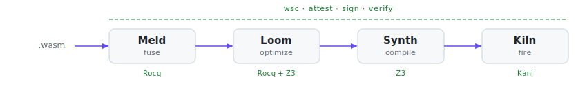

# PulseEngine

Formally verified WebAssembly toolchain for safety-critical systems

&nbsp;

&nbsp;

[<kbd> &nbsp; Repositories &nbsp; </kbd>](https://github.com/orgs/pulseengine/repositories) &nbsp;&nbsp; [<kbd> &nbsp; Documentation &nbsp; </kbd>](https://docs.rs/pulseengine-mcp-protocol) &nbsp;&nbsp; [<kbd> &nbsp; Examples &nbsp; </kbd>](https://github.com/pulseengine/wasm-component-examples)

<h6>
  <a href="https://github.com/pulseengine/kiln">Kiln</a>
  ·
  <a href="https://github.com/pulseengine/meld">Meld</a>
  ·
  <a href="https://github.com/pulseengine/loom">Loom</a>
  ·
  <a href="https://github.com/pulseengine/synth">Synth</a>
  ·
  <a href="https://github.com/pulseengine/wsc">Sigil</a>
</h6>

&nbsp;

## The Pipeline

Meld fuses. Loom weaves. Synth compiles. Kiln fires. Sigil seals.

&nbsp;

<table>
<tr>
<td width="50%" valign="top">

### [Meld](https://github.com/pulseengine/meld)

Statically fuses multiple WebAssembly P2/P3 components into a single core module. Import resolution, index-space merging, and canonical ABI adapter generation happen at build time — runtime linking eliminated entirely. Every transformation carries Rocq mechanized proofs covering parsing, resolution, merging, and adapter correctness.

</td>
<td width="50%" valign="top">

### [Loom](https://github.com/pulseengine/loom)

Twelve-pass WebAssembly optimization pipeline built on Cranelift's ISLE pattern-matching engine. Constant folding, strength reduction, CSE, inlining, dead code elimination — each pass proven correct through Z3 SMT translation validation and Rocq mechanized proofs. Includes a fused mode purpose-built for Meld output.

</td>
</tr>
<tr>
<td width="50%" valign="top">

### [Synth](https://github.com/pulseengine/synth)

Compiles WebAssembly to native ARM for embedded Cortex-M targets. Not just translation — program synthesis: exploring equivalent implementations for provably optimal native code. Pattern-based instruction selection, AAPCS calling conventions, and ELF generation. Z3 translation validation ensures the compiled output faithfully preserves WebAssembly semantics.

</td>
<td width="50%" valign="top">

### [Kiln](https://github.com/pulseengine/kiln)

WebAssembly runtime for safety-critical systems. Full Component Model and WASI Preview 2 support with a modular `no_std` architecture for embedded, automotive, medical, and aerospace environments. Bounded allocations, deterministic execution, and memory safety guaranteed through Kani bounded model checking.

</td>
</tr>
</table>

&nbsp;

### [Sigil](https://github.com/pulseengine/wsc) &mdash; Supply Chain Security

The cryptographic backbone of the pipeline. Every stage — fusion, optimization, compilation — creates a signed transformation attestation recording what changed, which tool version ran, and cryptographic hashes of inputs and outputs. The full chain is verifiable end-to-end.

Sigstore keyless signing for CI/CD. SLSA policy enforcement with per-tool version and hash constraints. Hardware security via TPM 2.0. Offline verification for air-gapped embedded environments. IoT device provisioning with pre-provisioned trust bundles. All signatures embedded directly in WebAssembly modules — no external registry required.

&nbsp;

> [!NOTE]
> **Correctness at every layer** &mdash; Kani bounded model checking in the runtime, Rocq mechanized proofs for fusion and optimization, Z3 SMT verification for compilation, and Sigil attestation chains binding it all together. No transformation ships without a proof.

&nbsp;

<b>Build & Verification</b>

&nbsp;

- [**rules_wasm_component**](https://github.com/pulseengine/rules_wasm_component) &mdash; Bazel rules for WebAssembly Component Model across Rust, Go, C++, and JavaScript
- [**rules_rocq_rust**](https://github.com/pulseengine/rules_rocq_rust) &mdash; Bazel rules for Rocq theorem proving and Rust formal verification with hermetic Nix toolchains
- [**rules_moonbit**](https://github.com/pulseengine/rules_moonbit) &mdash; Bazel rules for MoonBit with hermetic toolchain support

<b>AI & MCP</b>

&nbsp;

- [**mcp**](https://github.com/pulseengine/mcp) &mdash; Rust framework for building Model Context Protocol servers and clients, published to crates.io
- [**glsp-mcp**](https://github.com/pulseengine/glsp-mcp) &mdash; AI-native graphical modeling with MCP integration and WebAssembly component execution
- [**wasi-mcp**](https://github.com/pulseengine/wasi-mcp) &mdash; Proposed WASI API for Model Context Protocol, targeting Preview 3 standardization

<b>Developer Tools</b>

&nbsp;

- [**thrum**](https://github.com/pulseengine/thrum) &mdash; Gate-based pipeline orchestrator for autonomous AI-driven development
- [**temper**](https://github.com/pulseengine/temper) &mdash; GitHub App that hardens repositories to organizational standards
- [**wasm-component-examples**](https://github.com/pulseengine/wasm-component-examples) &mdash; Working examples for Component Model development in C, C++, Go, and Rust
- [**moonbit_checksum_updater**](https://github.com/pulseengine/moonbit_checksum_updater) &mdash; Native MoonBit checksum management with GitHub API integration

&nbsp;

---

Rust · WebAssembly Component Model · WASI Preview 2/3 · Bazel · Rocq · Z3 · Kani · Sigstore

